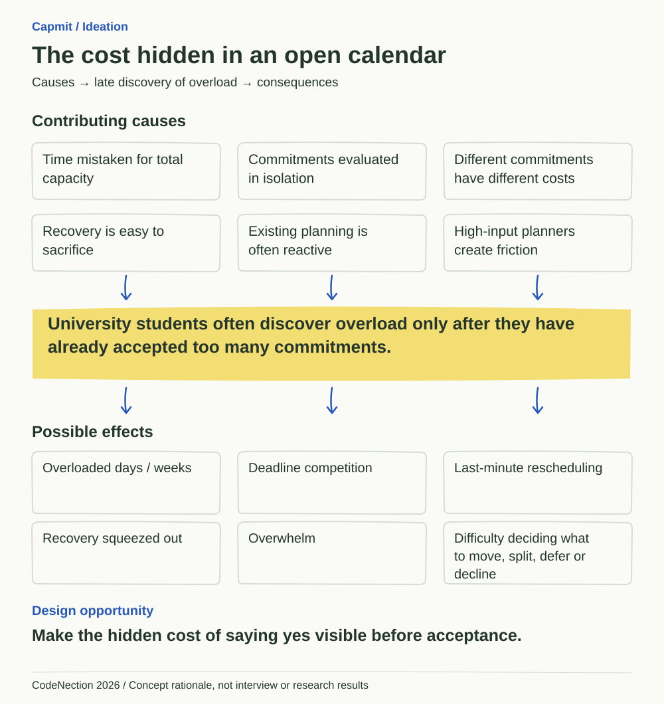
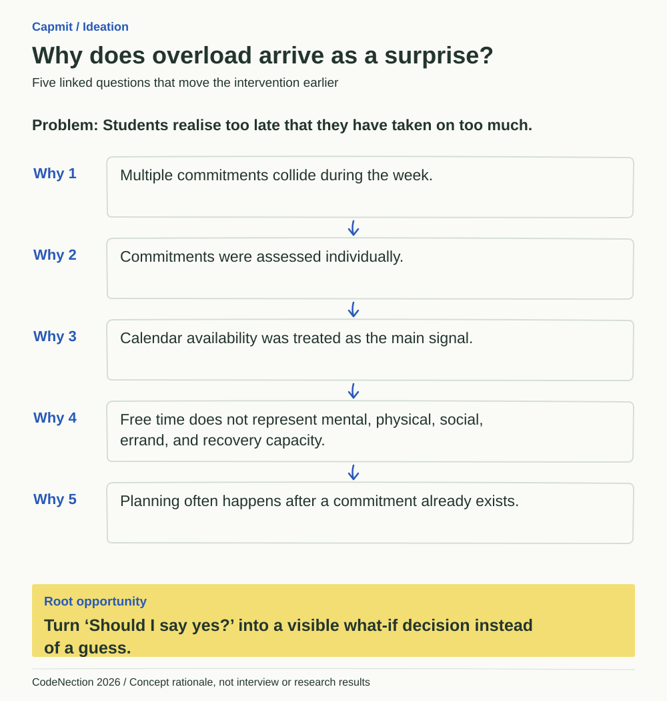
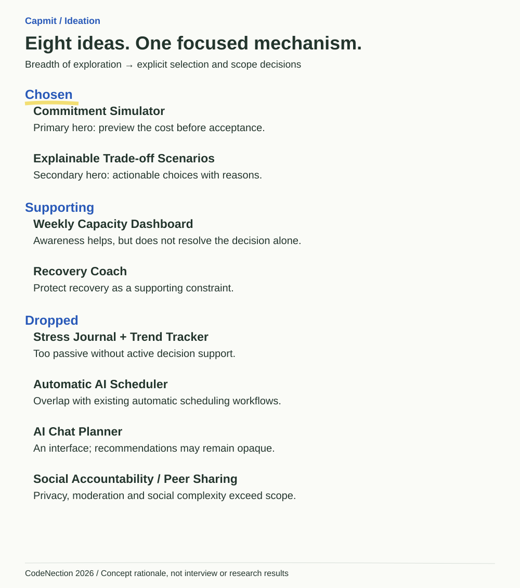
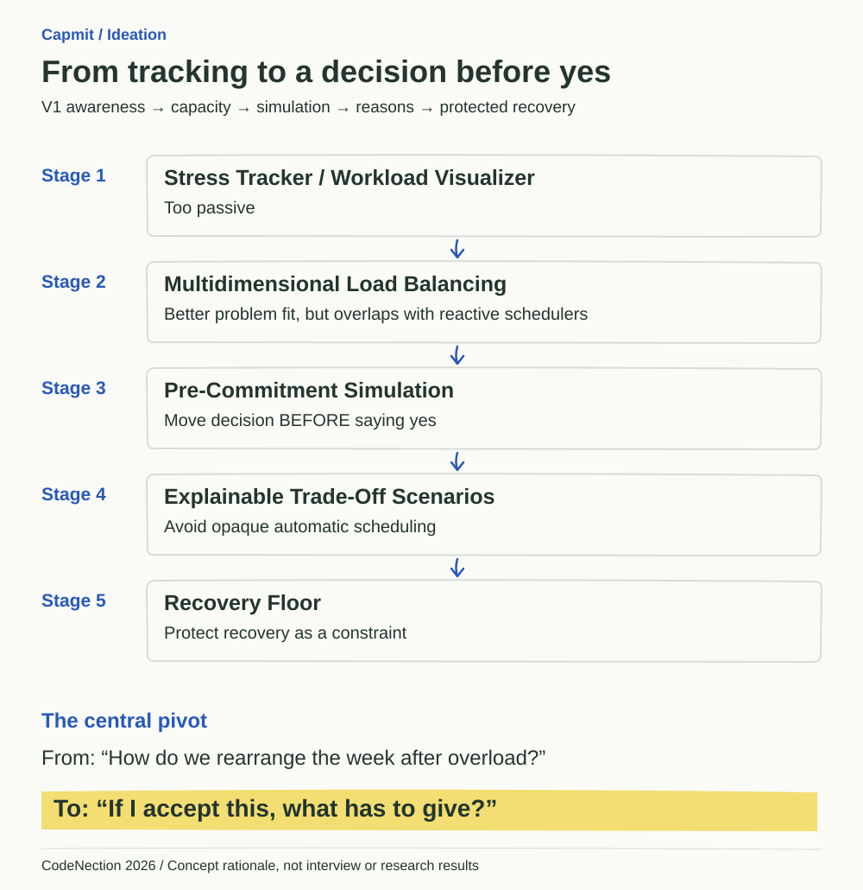
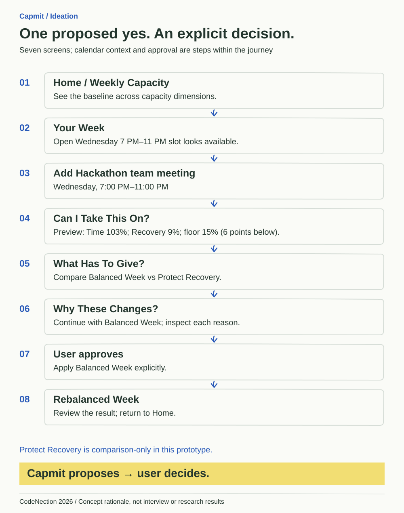
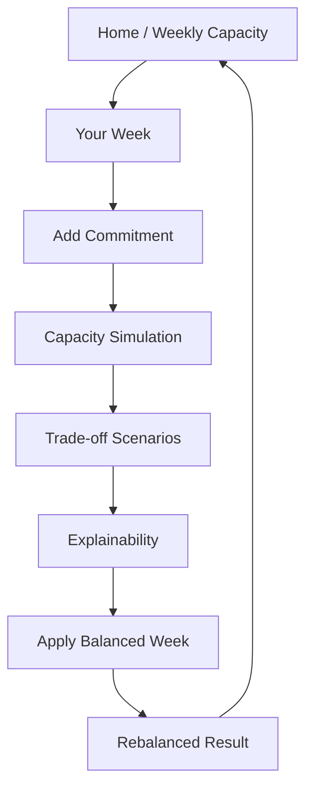
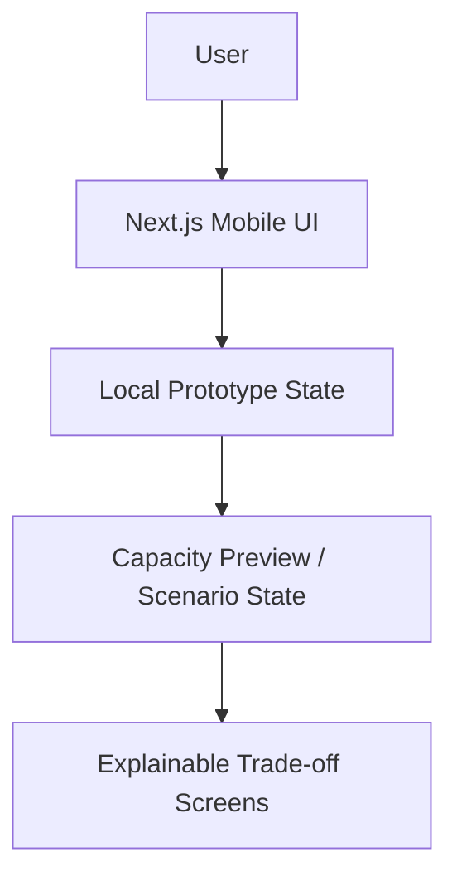

# Capmit

**Check your capacity before you commit.**

> A preventive workload decision-support app for university students that simulates the cost of a new commitment before they say yes, then shows what would need to change and why.

> Most planners ask: “Where can I fit this?”  
> Capmit asks: “If I say yes to this, what has to give?”

**Prototype Phase:** Interactive mobile-first coded prototype built with Next.js using local/mock scenario data. Prepared for the CodeNection 2026 Prototype Phase submission.

- Live Prototype: `TBD — deployment pending`
- GitHub Repository: [nuzas96/capmit](https://github.com/nuzas96/capmit)
- Presentation Slides: `TBD`
- Video Presentation: `TBD`

## Team

- Team Name: `TBD`
- Team Members:
  - `TBD`
  - `TBD`

## 1. Project Overview

### Problem Statement

Capmit addresses the CodeNection 2026 Lifestyle & Personal Productivity problem statement: **Beating the Burnout — Stress & Workload Manager**.

University students juggle assignments, lectures, club responsibilities, part-time work, errands, exercise, social commitments, and recovery. A conventional calendar answers “Is there free time?” but that does not answer “Do I actually have enough overall capacity?”

A four-hour calendar gap can coexist with high mental, social, physical, or errand demand and little room for recovery. When students assess commitments individually, they can accept each apparently manageable request and discover the cumulative cost later.

> University students often discover overload only after they have already accepted too many commitments.

### Contributing Causes

- Calendar free time is mistaken for total capacity.
- Commitments are evaluated one at a time.
- Equal-duration commitments can have different mental, social, and physical costs.
- Flexible recovery is often sacrificed first.
- Many planning workflows react after commitments already exist.
- High manual-input burden can make planners difficult to maintain.

### Stakeholders

**Primary:** university students.

**Secondary/contextual:** classmates and project teammates; club and society teams; lecturers and academic commitments; part-time employers; and the university student-support ecosystem. They shape the demands around a student's week; this does **not** mean they receive the student's private capacity data.

### Target User

University students balancing academic and non-academic commitments across several life dimensions.

The prototype follows **Aina**, who balances classes, assignments, gym, household errands, student-club work, and recovery. Her Wednesday still shows an open **7 PM–11 PM** slot, so she considers a **Hackathon team meeting**.

### Existing Solutions / Market Context

The team's concept review considered **Motion, Structured, Amazing Marvin, Tiimo, Reclaim, ChronoPlan, and ZoBud**. Existing tools offer valuable approaches including auto-scheduling, energy-aware planning, task attributes, recovery support, and dynamic replanning. These observations position the concept; they are not a feature-by-feature audit of every product.

Scheduling automation, energy awareness, recovery support, and multidimensional task attributes already exist in the wider landscape. Those individual features are not our novelty claim.

> Our differentiation is not a single isolated feature. It is moving capacity-aware trade-off decision support to the moment before a student commits.

**Proposed commitment → what-if capacity simulation → explicit consequence → alternative trade-off scenarios → explainable reasons → user approval.**

| Capability | Typical planner / scheduler landscape | Capmit prototype |
| --- | --- | --- |
| Calendar scheduling | Established capability | Contextual timetable for the demo |
| Capacity awareness | Varies | Central to the journey |
| Multidimensional load | Available in some tools | Core model, demonstrated with fixed estimates |
| Rebalancing | Common planning function | Two predefined scenarios |
| Before-commitment simulation | Less central in the workflows reviewed | Core interaction |
| Explainable trade-off scenarios | Varies | Visible changes and reasons |
| User approves changes | Varies | Explicit review and approval step |

This comparison does not imply that every named tool lacks any particular capability.

### Our Solution

Capmit models commitments across multiple capacity dimensions and lets a student preview a new commitment before accepting it. The preview surfaces overload and threats to a protected Recovery Floor. It presents alternative trade-offs with reasons, keeping the student in control. The Prototype Phase uses Aina's controlled scenario to validate the interaction model; the Building Phase generalizes it into a deterministic engine.

> It fits your calendar. It doesn’t fit your capacity.

### Core Feature Set

**Demonstrated in the current prototype:**

- Weekly multidimensional capacity view.
- “Can I Take This On?” pre-commitment simulator.
- Before → after capacity preview.
- Recovery Floor protection.
- Explainable trade-off scenarios.
- Balanced Week vs Protect Recovery comparison (Balanced Week continues to application).
- Commitment template/default load profile demonstrated by the prefilled Hackathon meeting.
- Fixed / Flexible / Splittable / Optional constraints represented in the demo and its explanations.
- Human approval before applying changes in the local demo.
- Rebalanced-week before/after result.

**Future Building Phase:** reusable editable templates, saved personal load defaults and commitments, generalized constraint handling, and calculated scenarios from user data. The current demo is not an arbitrary commitment editor or a production scheduling engine.

### Reach & Scalability

Capmit begins with university students because their weeks combine academic, social, organisational, personal, and recovery commitments. The intended impact is a more informed decision at acceptance, with recovery considered early. During the Building and Deployment phases, we plan to validate whether this earlier decision point helps students make more intentional commitments.

The scaling path is reusable commitment templates for different student routines, configurable personal capacity limits, and saved personal load defaults. Optional calendar import and university calendar/LMS integrations could reduce entry effort later; adaptation for internship and early-career workloads could extend the audience. These are future directions, not claims of current integration, adoption, or proven impact.

## 2. Ideation & Process

### 2.1 Ideas We Considered

| Idea | Decision | Why |
| --- | --- | --- |
| Commitment Simulator | Chosen — Primary Hero Feature | Shows the consequence before the user accepts a commitment. |
| Explainable Trade-off Scenarios | Chosen — Secondary Hero Feature | Turns overload detection into actionable, user-controlled choices. |
| Weekly Multidimensional Capacity Dashboard | Kept as supporting feature | Awareness helps, but visualization alone does not resolve the decision. |
| Recovery Coach | Kept as supporting layer | Recovery matters, but does not differentiate the mechanism by itself. |
| Stress Journal + Trend Tracker | Dropped as core concept | Too passive; active support and rebalancing matter more than tracking alone. |
| Automatic AI Scheduler / Rebalancer | Dropped as core concept | Overlap with automatic schedulers such as Motion and Reclaim risked making another AI calendar. |
| AI Chat Planner | Dropped | Chat is an interface, and recommendations can feel opaque. |
| Social Accountability / Peer Workload Sharing | Dropped from prototype scope | Adds privacy, moderation, and social-product complexity without enough benefit to the core interaction. |

### Idea Evolution

| Stage | Direction | What drove the next step |
| --- | --- | --- |
| 1 | Stress tracker / workload visualizer | Too passive. |
| 2 | Multidimensional load balancing | Better problem fit, but the concept review showed overlap with reactive schedulers. |
| 3 | Pre-commitment simulation | Move the decision point **before** the user says yes. |
| 4 | Explainable trade-off scenarios | Avoid opaque automatic scheduling. |
| 5 | Recovery Floor | Protect minimum recovery instead of treating it as leftover time. |

The major pivot was:

> From: “How do we rearrange the week after overload?”
>
> To: “If I accept this, what has to give?”

### 2.2 Ideation Boards

These diagrams document the actual concept trail. Causes and effects are working problem hypotheses, not fabricated interviews, mentor feedback, or measured research outcomes.

#### Problem Tree



Six contributing causes converge on late discovery of overload and its possible effects. The design opportunity is to make the hidden cost of saying yes visible before acceptance.

#### Five Whys



The chain connects collisions during the week to isolated commitment decisions and an incomplete calendar signal. It leads to a visible what-if decision at the point of acceptance.

#### Concept Exploration



Eight distinct ideas show the breadth of exploration: two chosen mechanisms, two supporting layers, and four dropped concepts. Short reasons make the scope decisions traceable.

#### Idea Evolution



The progression makes the V1-to-final pivot visible: from workload awareness to pre-commitment simulation, explainable alternatives, and recovery as a constraint.

#### User Flow



The actual seven-screen journey connects an apparently free Wednesday slot to an explicit decision. Balanced Week is the implemented review/apply path; Protect Recovery remains comparison-only.

### 2.3 Mentor Consultation

| Date | Mentor | Feedback | What We Changed |
| --- | --- | --- | --- |
| TBD | TBD | Mentor consultation not yet documented | TBD |

> This section will be updated only with actual mentor feedback received by the team.

## 3. Design & Prototype

### Prototype

Capmit is implemented as a mobile-first interactive Next.js prototype. Start at `/home`; the root route `/` is the capacity-check screen.



“Apply Balanced Week” is an action in the seven-screen journey, not an eighth screen. The result is a predefined local demonstration; no external calendar is changed and no persistent personal schedule is saved.

### Core Demo Story

Aina considers **Hackathon team meeting — Wednesday, 7:00 PM–11:00 PM**. It fits an open calendar slot, but accepting it without changes produces this preview:

| Dimension | Before acceptance | With the meeting |
| --- | ---: | ---: |
| Time used | 87% | 103% |
| Mental used | 72% | 81% |
| Social used | 61% | 84% |
| Recovery remaining | 22% | 9% |
| Recovery Floor | 15% | 15% |

Time exceeds its limit by **3 points**. Recovery falls **6 points below the floor**.

> It fits your calendar. It doesn’t fit your capacity.

Capmit presents two scenario choices:

| Outcome | Balanced Week | Protect Recovery |
| --- | --- | --- |
| Peak time | 89% | 85% |
| Recovery remaining | 17% | 24% |
| Deadlines protected | Yes | Yes |
| Changes | 3 supporting changes | 2 schedule changes; one optional commitment removed |
| Prototype scope | Review and apply journey implemented | Comparison-only |

**Balanced Week changes:**

1. Laundry: Wednesday → Thursday.
2. Assignment: split the 3h block into Wednesday 2h and Thursday 1h.
3. Optional club admin: Wednesday → Friday.

**Wind-down remains protected and unchanged. It is not a fourth schedule change.** Protect Recovery can be inspected and selected for comparison; continuing from it explicitly offers review of Balanced Week.

### Prototype Screens

The reference column links **approved visual references**; the capture column links **actual implementation screenshots** captured from the local app at 390px viewport width. Device frames in reference images are not part of the implementation.

Screen 4 is captured with the commitment included and the final preview visible. Screen 5 shows Balanced Week selected; Screen 7 shows the predefined Balanced Week result. Captures use reduced motion to record stable final states and are full-page images, so they can be opened at original size.

| Screen | Implemented route | Approved visual reference | Implementation capture |
| --- | --- | --- | --- |
| 1. Home / Weekly Capacity | `/home` | [View reference](public/references/capmit-screen1-target.png) | [View actual screen](public/screenshots/screen1.png) |
| 2. Your Week | `/your-week` | [View reference](public/references/capmit-screen2-target.png) | [View actual screen](public/screenshots/screen2.png) |
| 3. Add Commitment | `/add-commitment` | [View reference](public/references/capmit-screen3-target.png) | [View actual screen](public/screenshots/screen3.png) |
| 4. Can I Take This On? | `/` | [View reference](public/references/capmit-screen4-target.png) | [View actual screen](public/screenshots/screen4.png) |
| 5. What Has To Give? | `/trade-offs` | [View reference](public/references/capmit-screen5-target.png) | [View actual screen](public/screenshots/screen5.png) |
| 6. Why These Changes? | `/why-these-changes` | [View reference](public/references/capmit-screen6-target.png) | [View actual screen](public/screenshots/screen6.png) |
| 7. Rebalanced Week | `/rebalanced-week` | [View reference](public/references/capmit-screen7-target.png) | [View actual screen](public/screenshots/screen7.png) |

## 4. What Makes It Different

### 1. Decision support BEFORE commitment

Capmit centres “Can I take this on?” at the point of acceptance. The user inspects consequences before the proposed commitment becomes part of the plan. This is an interaction focus, not a claim of being the first product to offer it.

### 2. Capacity is more than calendar time

Commitments can consume **Time, Mental, Physical, Social, and Errand capacity**, while recovery is tracked as **remaining protected capacity**. Two commitments with equal duration can therefore have different costs. The prototype demonstrates this distinction with fixed estimates.

### 3. Explainable trade-offs, not opaque rescheduling

Capmit exposes alternatives and reasons rather than silently rearranging the week:

| Commitment property | Planning rationale |
| --- | --- |
| Flexible | Safe to move |
| Splittable | Safe to divide |
| Protected recovery | Must stay |
| Optional + low consequence | Safer to defer |

> Capmit proposes. You decide.

### Recovery Floor

The **15% Recovery Floor** is a supporting constraint and signature visual, not the entire differentiation. A preview that crosses it is explicitly marked and explained. It is a demo planning threshold, not a clinically established minimum.

## 5. Technical Architecture & Feasibility

### Current Prototype Architecture

| Layer | Choice | Why | Constraint / Risk |
| --- | --- | --- | --- |
| Frontend | Next.js 16 App Router + React 19 | Component-driven mobile UI, routing, and reusable Building Phase code | Currently uses authored local scenario state |
| Language | TypeScript | Safer structured commitment/capacity models | Types do not validate the quality of capacity estimates |
| Styling | Tailwind CSS 4 setup, global CSS tokens, route-specific CSS Modules | Scoped responsive styling and precise design control | Custom illustrated UI needs careful responsive QA |
| Typography / assets | Public Sans + Patrick Hand via `next/font/google`; local SVG/PNG assets | Readable data with a recognizable planner identity | Font fetching can require network access during a fresh build |
| Local/mock state | React state; sessionStorage for the included-commitment preview | Validates interaction without backend plumbing | No durable schedule persistence or arbitrary user data; session preview only |
| Hosting target | Vercel | Natural Next.js deployment workflow | Public deployment pending |
| Backend / data — future | Supabase authentication + PostgreSQL | Saved commitments and preferences with a focused implementation path | Schema, access controls, and row-level security must be implemented and tested |
| AI — future / optional | Natural-language input parsing | Could reduce input friction | Must not be the source of truth for scheduling decisions |

The current prototype has **no backend, database, authentication, or AI** and requires **no paid external API**.



The controlled scenario demonstrates the full decision sequence. Generalized capacity calculations and scenario generation are the next engineering milestone.

### Why This Is Feasible

The core mechanism does not depend on an LLM. A production implementation could use a deterministic pipeline:

**Commitments → load profiles → personal capacity limits → constraints → overflow detection → candidate changes → scenario scoring → explanation → user approval.**

Possible scoring factors include capacity overflow, deadline violations, Recovery Floor violations, importance/consequence loss, disruptive change count, and user preferences. Explicit constraints make the mechanism testable and its recommendations explainable. Calibrating useful load estimates and validating them with students remain future work.

### Build-Phase Architecture

**Future proposal, if qualified — not implemented:** a responsive Next.js PWA with Supabase for backend services and PostgreSQL storage.

Potential additions are authentication, saved commitments, personal capacity preferences, commitment history, reusable load templates, and a real deterministic constraint/rebalancing engine.

Optional AI could parse “quiz tomorrow, work Saturday for six hours, need groceries” into structured commitments. It would remain supporting functionality: final acceptance and rebalancing should be understandable and validated against deterministic constraints.

Google Calendar, LMS connections, and notifications are potential later integrations, not current capabilities.

### Three-Week Building Plan

**Planned Building Phase: 21 September – 11 October 2026, if qualified.**

| Week | Focus and scope | Deliverable |
| --- | --- | --- |
| **1 · 21–27 September** | **Data + Core Engine Foundation.** Implement commitment/capacity models; add Supabase persistence with per-user access controls; save capacities and commitments; implement template defaults; generalize the fixed demo into deterministic calculations. | A user can enter/save commitments and receive calculated capacity previews. |
| **2 · 28 September–4 October** | **Rebalancing + Explainability.** Handle Fixed / Flexible / Splittable / Optional constraints; generate candidate changes; score scenarios; produce at least two meaningful alternatives; connect every suggestion to deterministic explanations. | Real “What has to give?” scenarios from user data. |
| **3 · 5–11 October** | **Validation + Deployment Readiness.** Refine onboarding and input friction; check responsive/accessibility behavior; handle errors and edge cases; prepare deployment; test realistic student schedules; fix defects found during validation. | A validated core journey ready for deployment, with known limitations documented. |

**Optional only if the core engine is stable:** calendar import and natural-language input.

**Out of core build scope:** complex LMS integrations, social features, autonomous AI scheduling, learned personalization, and a notification ecosystem.

### Feasibility Risks & Mitigations

| Risk | Mitigation |
| --- | --- |
| Capacity values are subjective | Editable template defaults and personal planning estimates, not clinical truth. |
| Scenario search can become combinatorially large | Limit candidate changes to flexible, splittable, or optional commitments and rank a small set of alternatives. |
| Manual input friction | Template defaults with optional adjustments. |
| Third-party integration complexity | Keep integrations independent of the core three-week build. |
| Limited time | Build the core engine first; AI and integrations remain optional stretch goals. |

The prototype and planned core Building Phase can function without paid external APIs. Hosting/storage quotas and operational limits still need checking before public use; optional integrations are not dependencies of the decision engine.

### Scope Discipline

Prototype Phase focuses on problem framing, the interaction model, UX, explainability, and the end-to-end hero journey. It avoids authentication, database plumbing, live calendar integrations, and production AI. This keeps the proposed next three-week Building Phase focused on validating and implementing the core mechanism rather than expanding into every possible integration.

## Prototype Scenario

All values are **demo capacity estimates**, not clinical measurements.

| Baseline dimension | Value | Meaning |
| --- | ---: | --- |
| Time | 87% | Used |
| Mental | 72% | Used |
| Physical | 44% | Used |
| Social | 61% | Used |
| Errands | 38% | Used |
| Recovery | 22% | Remaining |
| Recovery Floor | 15% | Protected threshold |

Home also displays **22% calendar space available**, **11% estimated capacity available**, and a **7% recovery buffer** above the floor. Calendar availability and estimated capacity availability are distinct demo indicators.

**Proposed commitment:** Hackathon team meeting, Wednesday, 7 PM–11 PM.

| Expected profile | Value |
| --- | --- |
| Time | 4h |
| Mental | Medium |
| Social | High |
| Physical | Low |
| Errand | None |
| Rules | Optional; fixed time; not splittable |

> These prototype values demonstrate the product interaction and are not medical, psychological, or burnout scores.

## Design Principles

**The Annotated Week** is a clean student planner actively marked up to understand consequences.

- Mobile-first composition, warm off-white page, dark green/charcoal ink, proposal blue, and yellow insight highlights.
- Patrick Hand for expressive headings and annotations; Public Sans for readable data and controls.
- Semantic doodles: connectors trace consequences, rings identify breaches, brackets measure shortfalls, and highlights draw attention to decisions.
- One clear primary action per screen; informative rather than alarming warnings.
- Recovery is protected capacity, not a productivity reward.
- Meaning does not rely on colour alone; interactive targets are approximately 44px or larger, with visible keyboard focus.

The signature animation moves recovery **22% → 9%** over roughly **450ms**, crossing the stationary **15% Recovery Floor**. The original baseline remains visible and the shortfall bracket explains the gap. Time, Mental, and Social update immediately. Reduced-motion users receive the final state without the animation.

## Prototype Quality Checks

Completed during the prototype audit:

- Seven-screen flow audited end-to-end through Balanced Week.
- Tested at 390px and 320px mobile widths, with no horizontal overflow in the audited states.
- Keyboard-accessible interactive controls, visible focus, and approximately 44px+ interactive targets checked.
- Reduced-motion handling checked for the recovery animation.
- Screen 1, Screen 2, and Screen 4 overlapping baseline values aligned.
- Lint, TypeScript checks, and production build passed before the finalized prototype was pushed.

These checks are not a claim of formal accessibility certification or a measured health outcome. No Lighthouse score is claimed.

## Running Locally

With Node.js and npm installed:

```bash
git clone https://github.com/nuzas96/capmit.git
cd capmit
npm install
npm run dev
```

Then open [http://localhost:3000/home](http://localhost:3000/home). The development server binds to `127.0.0.1`; [http://127.0.0.1:3000/home](http://127.0.0.1:3000/home) is also available. Start at `/home` to follow the whole journey.

The actual scripts in `package.json` are:

| Command | Script |
| --- | --- |
| `npm run dev` | `next dev --hostname 127.0.0.1` |
| `npm run lint` | `eslint .` |
| `npm run typecheck` | `next typegen && tsc --noEmit` |
| `npm run build` | `next build` |
| `npm run start` | `next start --hostname 127.0.0.1` |

For production validation and a local production server:

```bash
npm run lint
npm run typecheck
npm run build
npm run start
```

No backend credentials or environment secrets are needed for the demo. Font fetching during a fresh build may require internet access.

## Project Structure

```text
app/
  layout.tsx                  # Shared document and fonts
  globals.css                 # Tokens, shared styling, capacity-check styling
  page.tsx                    # Screen 4: capacity check at /
  demo-preview.ts             # Local preview state
  home/                       # Screen 1
  your-week/                  # Screen 2
  add-commitment/             # Screen 3
  trade-offs/                 # Screen 5
  why-these-changes/          # Screen 6
  rebalanced-week/            # Screen 7
public/
  doodles/                    # Standalone SVG illustrations
  references/                 # Seven approved visual targets
  ideation/                   # Five SVG concept/process diagrams
  screenshots/                # Seven actual 390px implementation captures
AGENTS.md                     # Stable project constraints
README.md
package.json
package-lock.json
next.config.ts
tsconfig.json
postcss.config.mjs
eslint.config.mjs
.gitignore
```

Each named screen directory contains its page and CSS Module. Dependencies, build output, local caches, and environment secrets are excluded from Git.

## Research Context

The concept was informed by research showing that student burnout and workload are associated with multiple factors, including academic demand, sleep, social support, lifestyle, and role/task overload. This provides broad context for considering more than calendar time; it does not validate Capmit's demo percentages or establish that the product clinically prevents burnout.

No verified research bibliography is included in the repository yet. Research links will be added only after verification.

## Current Status

Prototype Phase:

- 7-screen interactive prototype: Complete
- End-to-end flow: Complete
- Mobile audit: Complete
- GitHub repository: Complete
- Public deployment: Pending
- Ideation board images: Complete
- Mentor consultation documentation: Pending
- Presentation slides: Pending
- Video: Pending

## Submission Links

GitHub:  
[https://github.com/nuzas96/capmit](https://github.com/nuzas96/capmit)

Live Prototype:  
TBD

Presentation Slides:  
TBD

Video Presentation:  
TBD
